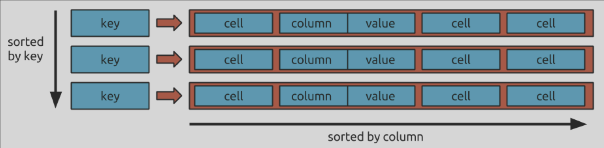

# JanusGraph

|Name|	JanusGraph |
|---|---|
Description	|A Graph DBMS optimized for distributed clusters 
Primary database model|	Graph DBMS
DB-Engines Ranking 	ranking trend | #8	  Graph DBMS
Website	| janusgraph.org
Technical documentation	| docs.janusgraph.org
Developer	| Linux Foundation; originally developed as Titan by Aurelius
Initial release|	2017
Current release	| 0.6.0, September 2021
License 	| Open Source 
Cloud-based only |	no
Implementation language |	Java
Server operating systems	| Linux, OS X, Unix, Windows
Data scheme |	yes
Typing 	| yes
XML support 	| no
Secondary indexes	| yes
SQL |	no
APIs and other access methods	| Java API, TinkerPop Blueprints, TinkerPop Frames, TinkerPop Gremlin, TinkerPop Rexster
Supported programming languages |	Clojure, Java, Python
Server-side scripts |	yes
Triggers|	yes
Partitioning methods |	yes 
Replication methods 	|yes
MapReduce 	|yes 
Consistency concepts |	Eventual Consistency, Immediate Consistency
Foreign keys| 	yes 
Transaction concepts |	ACID
Concurrency |	yes
Durability |	yes 
User concepts |	User authentification and security via Rexster Graph Server

----

## Навигация 

* [Введение в графовые базы данных](##Введение-в-графовые-базы-данных)

* [История развития JanusGraph.](##История-развития-JanusGraph.)

* [Инструменты для взаимодействия с JanusGraph](##Инструменты-для-взаимодействия-с-JanusGraph)

* [Какой database engine используется в вашей СУБД?](##Какой-database-engine-используется-в-вашей-СУБД?)

* [Как устроен язык запросов в JanusGraph? Разверните БД с данными и выполните ряд запросов.](##Как-устроен-язык-запросов-в-JanusGraph?-Разверните-БД-с-данными-и-выполните-ряд-запросов.)

* [Распределение файлов БД по разным носителям](##Распределение-файлов-БД-по-разным-носителям)

* [На каком языке программирования написана JanusGraph?](##На-каком-языке-программирования-написана-JanusGraph?)

* [Какие типы индексов поддерживаются в БД? Приведите пример создания индексов.](##Какие-типы-индексов-поддерживаются-в-БД?-Приведите-пример-создания-индексов.)

* [Как строится процесс выполнения запросов в JanusGraph?](##Как-строится-процесс-выполнения-запросов-в-JanusGraph?)

* [Поддерживаются ли транзакции в вашей СУБД? Если да, то расскажите о нем.](##Поддерживаются-ли-транзакции-в-вашей-СУБД?-Если-да,-то-расскажите-о-нем.)

* [Какие методы восстановления поддерживаются в JanusGraph](##Какие-методы-восстановления-поддерживаются-в-JanusGraph)

* [Шардинг в JanusGraph.](##Шардинг-в-JanusGraph.)

* [Возможно ли применить термины Data Mining, Data Warehousing и OLAP в JanusGraph?](##Возможно-ли-применить-термины-Data-Mining,-Data-Warehousing-и-OLAP-в-JanusGraph?)

* [Какие методы защиты поддерживаются JanusGraph?](##Какие-методы-защиты-поддерживаются-JanusGraph?)

* [Какие сообщества развивают JanusGraph? Кто в проекте имеет права на коммит и создание дистрибутива версий? Расскажите об этих людях и/или компаниях.](##Какие-сообщества-развивают-JanusGraph?-Кто-в-проекте-имеет-права-на-коммит-и-создание-дистрибутива-версий?-Расскажите-об-этих-людях-и/или-компаниях.)

* [Как продолжить самостоятельное изучение языка запросов с помощью демобазы?](##Как-продолжить-самостоятельное-изучение-языка-запросов-с-помощью-демобазы?)

* [Где найти документацию и пройти обучение?](##Где-найти-документацию-и-пройти-обучение?)

* [Как быть в курсе происходящего?](##Как-быть-в-курсе-происходящего?)


## Введение в графовые базы данных
[В начало](##-Навигация)

В графовом хранилище каждая структурная единица, называемая узлом, представляет собой изолированный документ с данными произвольной формы. Узлы соединены ребрами, которые определяют связи между ними.

Такой подход упрощает визуализацию данных и анализ графов. Графовые базы данных обычно используются для определения взаимосвязей между точками данных. Большинство графовых баз данных поддерживают такие функции, как поиск узла с наибольшим количеством связей и поиск всех связанных узлов.

Графовые базы данных оптимизированы для проектов с графовыми структурами данных, таких как социальные сети и семантическая паутина


Основным преимуществом графовых баз данных в этом свете является универсальность, ведь в них можно хранить и реляционные, и документарные и сложные семантические данные. А сама модель построения БД может меняться и модифицироваться в процессе развития приложения без изменения архитектуры и исходных запросов.


С другой стороны, при незначительном количестве связей и больших объемах данных графовые БД демонстрируют значительно более низкую производительность, и это нужно обязательно иметь в виду.

#### Польза графовой модели

В отличие от других моделей данных, в графовых базах данных в приоритете взаимосвязи между сущностями. Поэтому не требуется вычислять связи с помощью внешних ключей или какими-то другими способами. Можно создавать сложные модели данных, используя только абстракции вершин и ребер.

В настоящее время бизнес и пользователи требуют приложений, которые работают все с большим и большим объемом данных, ожидая при этом высокой производительности и надежности. Представление данных в виде графа предлагает удобные средства для обработки сложных связей. Этот подход позволяет решить многие проблемы и помогает получить результаты в рамках заданного контекста.


---

## История развития JanusGraph.
[В начало](##-Навигация)

*  2012 Originally called TitanDB and was released and developed by a company called Aurelius.
* Early 2015 Acquired by DataStax, the company behind the Apache Cassandra database. But the development of TitanDB project was stagnated since the acquisition and no further release of any newer version since the release of the 1.0 version in Sep 2015.
* Late 2015 The open source community behind TitanDB took the project to The Linux Foundation, renamed it JanusGraph and kept on developing it.
* Late 2018 The project is still under development and just released its latest update.

JanusGraph is a branch forked from Titan on December 27, 2016. After that, the TiTan development team successively released four versions including 0.1.0rc1, 0.1.0rc2, 0.1.1, 0.2.0 in 2017, the latest version It was October 12, 2017.

---

## Инструменты для взаимодействия с JanusGraph
[В начало](##-Навигация)

#### Local Installation

In order to run JanusGraph, Java 8 SE is required. Make sure the `$JAVA_HOME` environment variable points to the correct location where either JRE or JDK is installed. JanusGraph can be downloaded as a .zip archive from the Releases section of the project repository.

```shell
$ unzip janusgraph-0.6.0.zip
Archive:  janusgraph-0.6.0.zip
  creating: janusgraph-0.6.0/
...
```

Once you have unzipped the downloaded archive, you are ready to go.

#### Running the Gremlin Console

The Gremlin Console is an interactive shell that gives you access to the data managed by JanusGraph. You can reach it by running the `gremlin.sh` script which is located in the project's `bin` directory (see images with structure below).


The Gremlin Console interprets commands using Apache Groovy, which is a superset of Java. Gremlin-Groovy extends Groovy by providing a set of methods for basic and advanced graph traversal funcionality. 


#### Running the JanusGraph Server

В большинстве реальных случаев использования, запросы к базе данных не будут выполняться с того же сервера, на котором хранятся данные. Вместо этого будет иерархия клиент-сервер, в которой сервер запускает базу данных и обрабатывает запросы, в то время как несколько клиентов создают эти запросы и, таким образом, читают и делают записи в базе данных независимо друг от друга. Эту модель поведения предоставляет JanusGraph.

In order to start a server on your local machine, simply run the `janusgraph-server.sh` script instead of the `gremlin.sh` script. You can optionally pass a configuration file as a parameter. The default configuration is located at `conf/gremlin-server/gremlin-server.yaml`.


A Gremlin server is now running on your local machine and waiting for clients to connect on the default port `8182`. To instantiate a client -- as done before -- run the `gremlin.sh` script. Again, a local Gremlin Console will show up. This time, instead of using it locally, we will connect the Gremlin Console to a remote server and redirect all of it's queries to this server. This is done by using the `:remote` command:

```bash
gremlin> :remote connect tinkerpop.server conf/remote.yaml
==>Configured localhost/127.0.0.1:8182
```

As you can probably tell from the log, the client and server are running on the same machine in this case. When using a different setup, all you have to do is modify the parameters in the conf/remote.yaml file.

---

## Какой database engine используется в вашей СУБД?
[В начало](##-Навигация)

see https://docs.janusgraph.org/storage-backend/

* Apache Cassandra
* Apache HBase
* Google Cloud Bigtable
* Oracle Berkeley DB Java Edition

---

## Как устроен язык запросов в JanusGraph? Разверните БД с данными и выполните ряд запросов.
[В начало](##-Навигация)


The examples in this section make extensive use of a toy graph distributed with JanusGraph called The Graph of the Gods. This graph is diagrammed below. 


|visual symbol|	meaning|
|---|---|
bold key	| a graph indexed key
bold key with star|	a graph indexed key that must have a unique value
underlined key	|a vertex-centric indexed key
hollow-head edge|	a functional/unique edge (no duplicates)
tail-crossed edge	|a unidirectional edge (can only traverse in one direction)

##### Loading with an index backend

The below example calls one of these `open` methods on a configuration that uses the [BerkeleyDB](https://docs.janusgraph.org/storage-backend/bdb/) storage backend and the [Elasticsearch](https://docs.janusgraph.org/index-backend/elasticsearch/) index backend:

```bash
gremlin> graph = JanusGraphFactory.open('conf/janusgraph-berkeleyje-es.properties')
==>standardjanusgraph[berkeleyje:../db/berkeley]
gremlin> GraphOfTheGodsFactory.load(graph)
==>null
gremlin> g = graph.traversal()
==>graphtraversalsource[standardjanusgraph[berkeleyje:../db/berkeley], standard]
```

Please see the [GraphOfTheGodsFactory](https://github.com/JanusGraph/janusgraph/blob/master/janusgraph-core/src/main/java/org/janusgraph/example/GraphOfTheGodsFactory.java) source code for details:

```java
public class GraphOfTheGodsFactory {
    ...
    public static void load(...) {
        ...
        management.makeVertexLabel("titan").make();
        management.makeVertexLabel("location").make();
        ...
        Vertex cerberus = tx.addVertex(T.label, "monster", "name", "cerberus");
        Vertex tartarus = tx.addVertex(T.label, "location", "name", "tartarus");
        ...
        jupiter.addEdge("father", saturn);
        jupiter.addEdge("lives", sky, "reason", "loves fresh breezes");
        ...
        neptune.addEdge("lives", sea).property("reason", "loves waves");
        neptune.addEdge("brother", jupiter);
        ...
        // commit the transaction to disk
        tx.commit();
    }
    ...
}
```

For those using `JanusGraph/Cassandra` (or `JanusGraph/HBase`), be sure to make use of `conf/janusgraph-cql-es.properties` (or `conf/janusgraph-hbase-es.properties`) and `GraphOfTheGodsFactory.load()`.

```bash
gremlin> graph = JanusGraphFactory.open('conf/janusgraph-cql-es.properties')
==>standardjanusgraph[cql:[127.0.0.1]]
gremlin> GraphOfTheGodsFactory.load(graph)
==>null
gremlin> g = graph.traversal()
==>graphtraversalsource[standardjanusgraph[cql:[127.0.0.1]], standard]
```

The Gremlin traversals below provide more examples over The Graph of the Gods. The explanation of each traversal is provided in the prior line as a `//` comment.

##### COHABITORS OF TARTARUS
```bash
gremlin> pluto = g.V().has('name', 'pluto').next()
==>v[2048]
gremlin> // who are pluto's cohabitants?
gremlin> g.V(pluto).out('lives').in('lives').values('name')
==>pluto
==>cerberus
gremlin> // pluto can't be his own cohabitant
gremlin> g.V(pluto).out('lives').in('lives').where(is(neq(pluto))).values('name')
==>cerberus
gremlin> g.V(pluto).as('x').out('lives').in('lives').where(neq('x')).values('name')
==>cerberus
```

---

## Распределение файлов БД по разным носителям
#### Local server mode
[В начало](##-Навигация)

[docs](https://docs.janusgraph.org/storage-backend/hbase/)


HBase (or different storage backend) can be run as a standalone database on the same local host as JanusGraph and the end-user application. In this model, JanusGraph and HBase communicate with one another via a localhost socket. 

#### Remote server mode


When the graph needs to scale beyond the confines of a single machine, then HBase  (or different storage backend) and JanusGraph are logically separated into different machines. In this model, the HBase cluster maintains the graph representation and any number of JanusGraph instances maintain socket-based read/write access to the HBase cluster. 


---

## На каком языке программирования написана JanusGraph?
[В начало](##-Навигация)

| Написана на | Java |
|---|---|
| Операционная система | Кросс-платформенное |
| Платформа | JVM |


---

## Какие типы индексов поддерживаются в БД? Приведите пример создания индексов.
[В начало](##-Навигация)


[docs](https://docs.janusgraph.org/schema/index-management/index-performance/)

JanusGraph supports two different kinds of indexing to speed up query processing: graph indexes and vertex-centric indexes (a.k.a. relation indexes). 


Graph indexes make global retrieval operations efficient on large graphs. 

Vertex-centric indexes speed up the actual traversal through the graph, in particular when traversing through vertices with many incident edges.

#### Graph Index

Consider the following queries

```python
g.V().has('name', 'hercules')
g.E().has('reason', textContains('loves'))
```

The first query asks for all vertices with the name hercules. The second asks for all edges where the property reason contains the word loves. Without a graph index answering those queries would require a full scan over all vertices or edges in the graph to find those that match the given condition which is very inefficient and infeasible for huge graphs.

Both types of indexes are created through the JanusGraph management system and the index builder returned by `JanusGraphManagement.buildIndex(String, Class)` where the first argument defines the name of the index and the second argument specifies the type of element to be indexed (e.g. `Vertex.class`).


#### Vertex-centric Indexes

Vertex-centric indexes, also known as Relation indexes, are local index structures built individually per vertex. They are stored together with edges and properties in `edgeStore`. There are two types of vertex-centric indexes, edge indexes and property indexes.

##### Edge Indexes

 A vertex-centric index can be define

 ```python
 graph.tx().rollback()  //Never create new indexes while a transaction is active
mgmt = graph.openManagement()
time = mgmt.getPropertyKey('time')
rating = mgmt.makePropertyKey('rating').dataType(Double.class).make()
battled = mgmt.getEdgeLabel('battled')
mgmt.buildEdgeIndex(battled, 'battlesByRatingAndTime', Direction.OUT, Order.desc, rating, time)
mgmt.commit()
//Wait for the index to become available
ManagementSystem.awaitRelationIndexStatus(graph, 'battlesByRatingAndTime', 'battled').call()
//Reindex the existing data
mgmt = graph.openManagement()
mgmt.updateIndex(mgmt.getRelationIndex(battled, 'battlesByRatingAndTime'), SchemaAction.REINDEX).get()
mgmt.commit()
```

##### Property Indexes


Similar to edge indexes, property indexes can be built to traverse properties based on associated meta-properties efficiently. The following toy example illustrates the usage of property indexes.

```python
graph = JanusGraphFactory.open("inmemory")
mgmt = graph.openManagement()
timestamp = mgmt.makePropertyKey("timestamp").dataType(Integer.class).make()
amount = mgmt.makePropertyKey("amount").dataType(Integer.class).cardinality(Cardinality.LIST).make()
mgmt.buildPropertyIndex(amount, 'amountByTime', Order.desc, timestamp)
mgmt.commit()

bob = graph.addVertex()
bob.property("amount", 100, "timestamp", 1600000000)
bob.property("amount", 200, "timestamp", 1500000000)
bob.property("amount", -150, "timestamp", 1550000000)
graph.tx().commit()

g = graph.traversal()
g.V(bob).properties("amount").has("timestamp", P.gt(1500000000))
```

--


## Как строится процесс выполнения запросов в JanusGraph?
[В начало](##-Навигация)

[docs](https://docs.janusgraph.org/advanced-topics/data-model/)

JanusGraph stores graphs in adjacency list format which means that a graph is stored as a collection of vertices with their [adjacency list](https://en.wikipedia.org/wiki/Adjacency_list). The adjacency list of a vertex contains all of the vertex’s incident edges (and properties). JanusGraph stores the adjacency list representation of a graph in any storage backend that supports the Bigtable data model.





---

## Поддерживаются ли транзакции в вашей СУБД? Если да, то расскажите о нем.
[В начало](##-Навигация)

[docs](https://docs.janusgraph.org/interactions/transactions/)

Almost all interaction with JanusGraph is associated with a transaction. JanusGraph transactions are safe for concurrent use by multiple threads. 

JanusGraph transactions are not necessarily ACID. They can be so configured on BerkeleyDB, but they are not generally so on Cassandra or HBase, where the underlying storage system does not provide serializable isolation or multi-row atomic writes and the cost of simulating those properties would be substantial.

##### Transaction Handling

Every graph operation in JanusGraph occurs within the context of a transaction.

```python
graph = JanusGraphFactory.open("berkeleyje:/tmp/janusgraph")
juno = graph.addVertex() //Automatically opens a new transaction
juno.property("name", "juno")
graph.tx().commit() //Commits transaction
```

---

## Какие методы восстановления поддерживаются в JanusGraph
[В начало](##-Навигация)

* Transaction Failure
* JanusGraph Instance Failure

```python
recovery = JanusGraphFactory.startTransactionRecovery(graph, startTime, TimeUnit.MILLISECONDS);
```

##### tx.recovery

|Name|	Description|	Datatype|	Default Value|	Mutability|
|---|---|---|---|---|
tx.recovery.verbose	|Whether the transaction recovery system should print recovered transactions and other activity to standard output|	Boolean	|false|	MASKABLE|


---

## Шардинг в JanusGraph.

[В начало](##-Навигация)

When JanusGraph is deployed on a cluster of multiple storage backend instances, the graph is partitioned across those machines. Since JanusGraph stores the graph in an adjacency list representation the assignment of vertices to machines determines the partitioning. 

There are two aspects to graph partitioning which can be individually controlled: `edge cuts` and `vertex cuts`.

##### Edge Cut

In assigning vertices to partitions one strives to optimize the assignment such that frequently co-traversed vertices are hosted on the same machine. Assume vertex A is assigned to machine 1 and vertex B is assigned to machine 2. An edge between the vertices is called a cut edge because its end points are hosted on separate machines. Traversing this edge as part of a graph query requires communication between the machines which slows down query processing. 

Hence, it is desirable to reduce the edge cut for frequently traversed edges. That, in turn, requires placing the adjacent vertices of frequently traversed edges in the same partition.


##### Vertex Cut

While edge cut optimization aims to reduce the cross communication and thereby improve query execution, vertex cuts address the hotspot issue caused by vertices with a large number of incident edges. While vertex-centric indexes effectively address query performance for large degree vertices, vertex cuts are needed to address the hot spot issue on very large graphs.

Cutting a vertex means storing a subset of that vertex’s adjacency list on each partition in the graph. In other words, the vertex and its adjacency list is partitioned thereby effectively distributing the load on that single vertex across all of the instances in the cluster and removing the hot spot.

---


## Возможно ли применить термины Data Mining, Data Warehousing и OLAP в JanusGraph?
[В начало](##-Навигация)

Techniques used for offline graph analysis (usually performed in a series of steps). This type of technology is called a graph computing engine. They can be regarded as a category with other big data analysis technologies, such as data mining and online analytical processing (Online Analytical Processing, OLAP).

##### OLAP Traversals
JanusGraph-Hadoop works with TinkerPop’s hadoop-gremlin package for general-purpose OLAP to traverse over the graph, and parallelize queries by leveraging Apache Spark.


---

## Какие методы защиты поддерживаются JanusGraph?
[В начало](##-Навигация)

 Securing the HTTP protocol port is generally done with a combination of firewalling and a reverse proxy with SSL encryption and HTTP authentication. There are a couple of ways to approach security on the native "transport" protocol port:

* The HTTP REST API, usually on port 9200
* The native "transport" protocol, usually on port 9300

Moreover, [Currently supported versions](https://docs.janusgraph.org/changelog/#currently-supported) of JanusGraph continue to receive security updates. If you are using an older version of JanusGraph that is no longer supported, please update to a supported version to continue to receive security updates.

---


## Какие сообщества развивают JanusGraph? Кто в проекте имеет права на коммит и создание дистрибутива версий? Расскажите об этих людях и/или компаниях.

[В начало](##-Навигация)

[git](https://github.com/JanusGraph/janusgraph)

The members of GitHub page:


* GitHub Discussions: see [`GitHub Discussions`](https://github.com/JanusGraph/janusgraph/discussions) 
  for all general discussions and questions about JanusGraph
  
* Chat rooms on Gitter:

  * [Our main chat room](https://gitter.im/JanusGraph/janusgraph) for all general discussions and questions about JanusGraph
  * [janusgraph-dev](https://gitter.im/janusgraph/janusgraph-dev) for discussions about the internal implementation of JanusGraph

* Stack Overflow: see the
  [`janusgraph`](https://stackoverflow.com/questions/tagged/janusgraph) tag

* Twitter: follow [@JanusGraph](https://twitter.com/JanusGraph) for news and
  updates

* LinkedIn: follow [JanusGraph](https://www.linkedin.com/company/janusgraph) for news and
  updates

* Mailing lists:

  * **janusgraph-users (at) lists.lfaidata.foundation**
    ([archives](https://lists.lfaidata.foundation/g/janusgraph-users/topics))
    for questions about using JanusGraph, installation, configuration, integrations

    To join with a LF AI & Data account, use the [web
    UI](https://lists.lfaidata.foundation/g/janusgraph-users/join); to
    subscribe/unsubscribe with an arbitrary email address, send an email to:

    * janusgraph-users+subscribe (at) lists.lfaidata.foundation
    * janusgraph-users+unsubscribe (at) lists.lfaidata.foundation

  * **janusgraph-dev (at) lists.lfaidata.foundation**
    ([archives](https://lists.lfaidata.foundation/g/janusgraph-dev/topics))
    for internal implementation of JanusGraph itself

    To join with a LF AI & Data account, use the [web
    UI](https://lists.lfaidata.foundation/g/janusgraph-dev/join); to
    subscribe/unsubscribe with an arbitrary email address, send an email to:

    * janusgraph-dev+subscribe (at) lists.lfaidata.foundation
    * janusgraph-dev+unsubscribe (at) lists.lfaidata.foundation

  * **janusgraph-announce (at) lists.lfaidata.foundation**
    ([archives](https://lists.lfaidata.foundation/g/janusgraph-announce/topics))
    for new releases and news announcements

    To join with a LF AI & Data account, use the [web
    UI](https://lists.lfaidata.foundation/g/janusgraph-announce/join); to
    subscribe/unsubscribe with an arbitrary email address, send an email to:

    * janusgraph-announce+subscribe (at) lists.lfaidata.foundation
    * janusgraph-announce+unsubscribe (at) lists.lfaidata.foundation


---

## Как продолжить самостоятельное изучение языка запросов с помощью демобазы?

[В начало](##-Навигация)


This section is a brief overview of the Gremlin query language. For more information on Gremlin, refer to the following resources:

* [Practical Gremlin](https://kelvinlawrence.net/book/Gremlin-Graph-Guide.html): An online book by Kelvin R. Lawrence providing an in-depth overview of Gremlin and it's interaction with JanusGraph.
* [Complete Gremlin Manual](https://tinkerpop.apache.org/docs/3.5.1/reference/): Reference manual for all of the Gremlin steps.
* [Gremlin Console Tutorial](https://tinkerpop.apache.org/docs/3.5.1/tutorials/the-gremlin-console/): Learn how to use the Gremlin Console effectively to traverse and analyze a graph interactively.
* [Gremlin Recipes](https://tinkerpop.apache.org/docs/3.5.1/recipes/): A collection of best practices and common traversal patterns for Gremlin.
* [Gremlin Language Drivers](https://tinkerpop.apache.org/index.html#language-drivers): Connect to a Gremlin Server with different programming languages, including Go, JavaScript, .NET/C#, PHP, Python, Ruby, Scala, and TypeScript.
* [Gremlin Language Variants](https://tinkerpop.apache.org/docs/3.5.1/tutorials/gremlin-language-variants/): Learn how to embed Gremlin in a host programming language.
* [Gremlin for SQL developers](http://sql2gremlin.com/): Learn Gremlin using typical patterns found when querying data with SQL.


## Где найти документацию и пройти обучение?
[В начало](##-Навигация)

https://docs.janusgraph.org/


## Как быть в курсе происходящего?
[В начало](##-Навигация)

Пользоваться интернетом.
